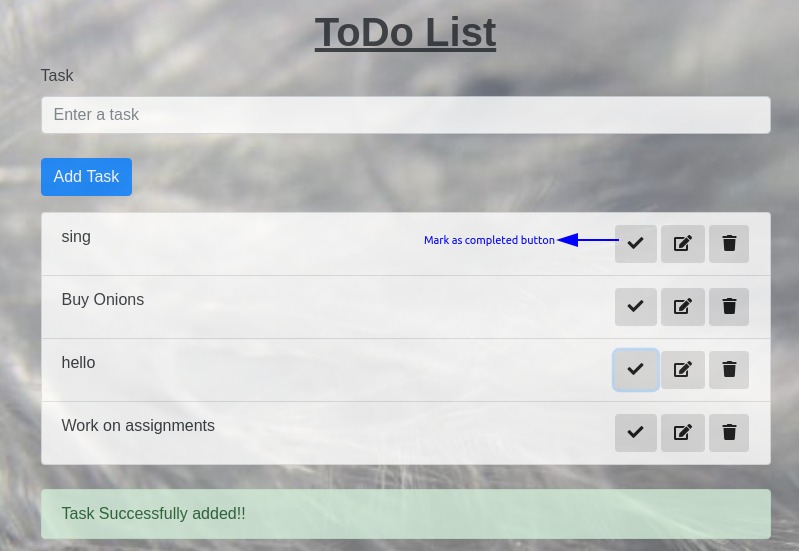
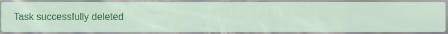

# **TODO Application**

A simple and interactive todo application to store all the task to be done.\

Technologies used:\

* Nodejs
* Database - MongoDB
* Express

It has the following features:

> * **Add Task**
> * **Edit Task**
> * **Delete Task**
> * **Mark task as Completed**
> * **Mark task as Incomplete**

## **ScreenShots**

* ### **Adding Task**


* ### **Editing Task**

> * Enter the task in the input form


> * Hit the Edit button


* ### **Deleting Tasks**


* ### **Mark Task as Completed**

>When you hit the mark as complete button on a task, it will render that task into the completed task list.



* ### **Mark Task as Incomplete**

>When you hit the mark as incomplete button on a task, it will render it back to the Uncompleted task list.


## **Extra Features Added**

* **Alert Class task is added**


* **Alert Class when task is deleted**



## **Dependencies**

```"dependencies": {
    "body-parser": "^1.19.0",
    "express": "^4.17.1",
    "joi": "^14.3.1",
    "mongodb": "^3.5.3",
    "nodemon": "^2.0.2",
    "path": "^0.12.7"
  }
```

> **Joi :** Joi allows you to create blueprints or schemas for JavaScript objects to ensure validation of key information.\
>**Nodemon :** Nodemon is a utility that will monitor for any changes in your source and automatically restart your server.Just use nodemon instead of node to run your code, and now your process will automatically restart when your code changes.\
>**body-parser :** Allows express to read the body and then parse that into a Json object that we can understand.

## **Running the app**

To run the app, in the command line/terminal type:\
`node app.js`\
OR after installing nodemon\
`nodemon app.js`
